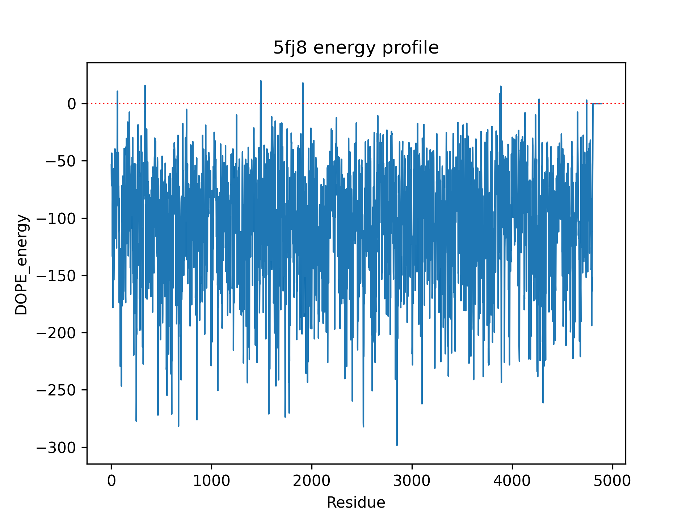
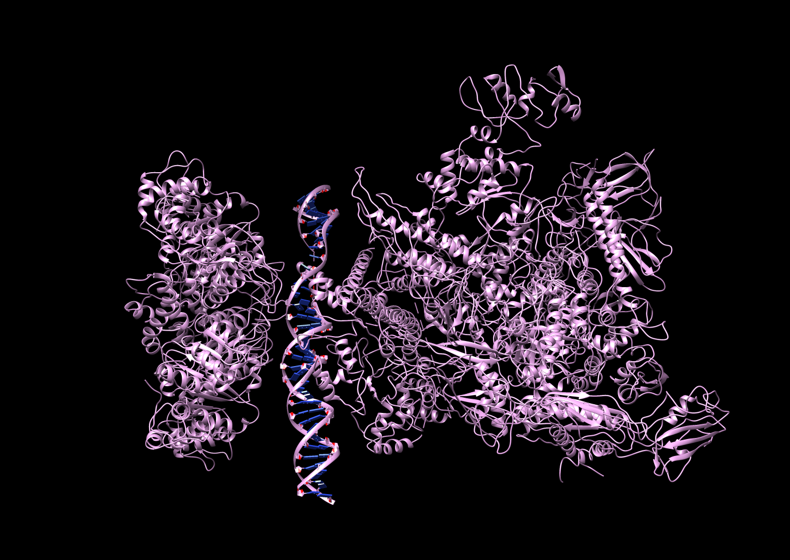

# MODELAIS

Authors: Socayna Jouide, Ariadna Net and Iñigo Oyarzun

## Table of Contents:
<!-- TOC depthFrom:1 depthTo:6 withLinks:1 updateOnSave:1 orderedList:0 -->
- [Background](#background)
	- [Modelais](#modelais)
- [Installation, Requirements and Execution](#installation-requirements-and-execution)
- [Modules](#modules)
- [Analysis](#analysis)
	- [6GMH](#6gmh)
	- [6OM3](#6om3)
	- [5FJ8](#5fj8)
	- [4G83](#4g83)
	- [5NSS](#5nss)
	- [3T72](#3t72)
- [Limitations](#limitations)
- [Bibliography](#bibliography)

<!-- /TOC -->
	
## Background
Monomers are single chains of amino acids, and they are the building blocks of proteins. As a result of combining several monomers together, multimeric complexes (or macro-complexes) are formed. These complexes can be composed of identical subunits (homomeric) or non-identical subunits (heteromeric), and they may also be composed of a mixture of monomers as well as carbohydrates, RNA or DNA. The latter type of macro-complexes is of paramount importance in the cell, since they are mainly involved in catalysis and regulation. However, the molecular principles of multimeric proteins interactions are difficult to understand mainly due to the geometrical and chemical characteristics of proteins themselves (Lynch 2013).

The aim of this project is to develop a method to model the macro-complex structure of biomolecules, formed by proteins and DNA.  That is, the program developed assembles a multimeric protein from different polypeptide chains given by Protein Data Bank (PDB) and the corresponding DNA attached to it. In this section, an overview of the Modelais program developed to assemble this kind of macro-complexes is given.

### Modelais
In the very beginning, the program will look for the input files that end with the “.pdb” extension in the specified folder, to process them. These files include the protein and DNA sequences desired to model, and the structures of the protein-protein and protein-DNA interactions. For the input files that are found, the function gets its chains and it assigns them a unique chain ID. Chains are aligned, and those that share a 95% of similarity or more are kept in a dictionary, while those that do not meet this requirement are removed. The dictionary has the chain ID as keys and the paired chains as values.

The next step is the the macro-complex construction, which is built by superimposition in several rounds. The first round is done by selecting a random pair of chains from the dictionary and making a complex out of them. Then, the program chooses one of the two chains and looks for similar pairs of chains in the dictionary to add them to the complex (either DNA or protein, whatever was randomly chosen first). These chains can now be referred as subunits since they are the building blocks of the complex.  The coordinates of the other subunit, the one that is not selected, are modified to fit the complex. In order to actually add the chains to the complex the superimposition between chains needs to have a filter for steric clashes.

Steric clashes occur when there is an unnatural overlap of any two non-bonding atoms, resulting in a Van der Waals energy repulsion, and as a result, a penalty in the overall energy. If there are several and severe steric clashes the resultant complex has a low-resolution structure. Therefore, a clashing filter has to be applied when modelling, so the complexes are built with a minimal perturbation in the backbone. Studies have shown that a distance between 0 and 2.5 Å in non-bonding atoms results in a high-resolution structure. However, from 2.5 Å onwards, the resulting complex has a low-resolution since the clashes are considered severe (Ramachandran et al. 2011). Therefore, in Modelais we have set the clash filter to 2 Å in order to be inside the high-resolution window. In addition, a maximum total of 30 clashes are allowed when the complex is being built.

The process goes on for several rounds, where in each round a different subunit of the complex is randomly selected, the chains that are similar to it are added to the complex if the steric clash filter criteria is met, and the coordinates of the rest of subunits are adapted to the new building block of the complex. This is done until all the chains in the complex available in the dictionary are included. It is important to note that the chains that keep adding to the complex could be either amino acid chains or DNA chains, since they are all forming the macro-complex in no particular order.

The output files are stored in a subdirectory inside a directory named results (see Installation, Requirements and Execution section for more information). The results include one macro-complex model that is ready to be further analysed by the user, a PNG file with the DOPE energy profile and its corresponding values in a txt file, and an INI file. The DOPE energy profile is built using modeller's and then using a window of 50 residues to smooth it in order to validate the model, and it is printed out for the user. If the optimization argument is used when executing Modelais, the results directory will also include four macro-complex models, and an optimized model. 

## Installation, Requirements and Execution
The program can be downloaded from: https://github.com/Socayna/modelais and installed with the `setup.py` script. 
To install this package you must unzip this folder and then run the next command: `sudo python3 setup.py install`. Another way of doing it is as it is done for the examples stated below: `python3 __main__.py [arguments]`.

Before executing the program, there are several requirements that need to be taken into account:
-	A directory with subdirectories containing the PDB files wished to analyse need to be present. Note that the path to the PDB files has to be specified in the command line using the following structure: directory/subdirectory.
-	If fasta files are also used, they should be downloaded too and saved into the same directory as the PDB files. The path has to be specified in the command line just like the PDB files.
-	Python3 needs to be installed to be able to execute the program.
- 	Biopython has to be installed to parse PDB files.
- 	Pandas package has to be installed to be able to work with different kinds of data used in Modelais.
-	Gooey is necessary to be able build the graphical user interface.
-	Modeller 9.23 has to be installed to be able to construct the complex and create the DOPE energy profile. It can be downloaded from [here](https://salilab.org/modeller/download_installation.html).
-	Matplotlib needs to be installed to be able to plot the DOPE profile energy for each model.
-	The USCF chimera application should be installed if the chimera option is used when executing the program. It can be downloaded from [here](https://www.cgl.ucsf.edu/chimera/download.html).

The options that come with `__main__.py` are specified in `arguments.py`, but a summary of the mandatory and optional arguments is shown here:
Mandatory arguments:
* `-i, --pdb`: Path with all the base pdb files to use.
* `-o, --output`: Name of the output.

Optional arguments
* `-fo, --format`: Format of the output (pdb or mmcif).
* `-h, --help`: Displays all the options available.
* `-fa, --fasta`: Fasta file with the sequences of the complex. It allows the user to compare the fasta file with the PDB file and filter the chains that the user might be interested in.
* `-v, --verbose`: Verbose mode prints log in stderr. If the user is only interested in the output, there’s no need to use this argument.
* `-opt, --optimization`: Optimize the macrocomplex.
* `-r, --resume`: Resume the program when it stops.
* `-sit, --sequence_identity_threshold`: Sequence identity threshold to use in the fasta filtering, if not used, the default is set to 0.3.
* `-c, --chimera`: Open models in Chimera automatically at the end of the execution of the program (in alphabetical order).
* `-gui, --graphic_interface`: Graphic user interface mode. The graphic interface consists of one window asking for the parameters and inputs, and after pressing Start, a shell window will appear on the screen showing the evolution of the program, as in the terminal. The user is able to go back to the input screen to restart the program when it has started the execution. Once the program is finished successfully, a green tick on the top right will appear together with a message, if not, a red cross will be displayed in the same spot.

Once everything is saved and the requirements are met, Modelais can be executed using the following command: `python3 __main__.py [options]`.

## Modules
The different modules needed to run Modelais are:
* `__main__.py`: It contains the core of the program; it is the one that needs to be executed. Many of its actions depend on functions defined on other scripts. 
* `optimize.py`: It takes as an input the model computed with `__main__.py` and gives as an output the optimized model and an energy profile graph.
* `messages.py`: Contains the messages shown when verbose option is used.
* `utils.py`: Contains all the functions needed for the main script to function.
* `arguments.py`: Contains all the arguments that can be used by the user when executing `__main__.py`.
* `plotting.py`: Allows the plotting of the energy profile and gives as a result a “.png” file.
* `interface.py`: Launches a graphical interface to get the options from the user.

## Analysis
In the analysis section, we execute the Modelais program with the proposed structures saved in the examples directory.

### 6gmh
The first example is the structure with PDB code [6GMH](https://www.rcsb.org/structure/6gmh), which is the activated transcription complex Pol II-DSIF-PAF-SPT6, involved in gene regulation. It has 20 unique protein chains and 3 unique nucleic acid chains (Vos et al. 2018). With Modelais we modelled this complex and compared it to the original PDB file using the following command:

`python3 __main__.py -i examples/6gmh -o 6gmh_model -fo pdb -v -fa examples/6gmh/6gmh.fasta.txt -sit 0.2 -c`

Once Modelais has finished running, the model output is opened in Chimera. Below we can see that the model has less secondary structure than the original one but they are almost identical. The energy profile indicates that the model is quite good for the first 4000 residues (it has a low energy), but, from 4000 residues to 6000 residues the energy increases significantly.

|  |  |  |
| :---: | :---: | :---: |
| *Original* | *Unoptimized Model* | *Energy profile*|

### 6om3
The second example is the structure with PDB code [6OM3](https://www.rcsb.org/structure/6om3), which is a crystal structure of the Orc1 BAH domain in complex with a nucleosome core particle. It contains 5 unique protein chains and 2 unique nucleic acid chains. This macrocomplex is essential for replication, heterochromatin formation, telomere maintenance and genome stability in eukaryotes (De Ioannes et al. 2019). With Modelais we modelled this complex and compared it to the original PDB file using the following command:

`python3 __main__.py -i examples/6om3 -o 6om3_model -fo pdb -v -opt -c`

We opened in Chimera the original PDB, the unoptimized model and the optimized model respectively, since the -opt option was used here. Three pictures with the same orientation were taken for the sake of comparison. We can clearly see that in the optimized model there is less secondary structure than in the original model or the unoptimized model. That is because when trying to optimize the program tries to minimize the energy as much as possible but it does not respect as much the original strucutre. Therefore, we end up with a different strucutre but with lower energy profile:

|  |  |  |  | 
| :---: | :---: | :---: | :---: |
| *Original* | *Unoptimized Model* | *Optimized model*| *Energy profile* | 

### 5fj8
This example is the structure with PDB code [5FJ8](https://www.rcsb.org/structure/5fj8), which is a structure of the yeast RNA polymerase III elongation complex with 17 unique proteic chains and 3 nucleic acid chains. Transcription of genes encoding small structured RNAs (transfer RNAs, nuclear RNA and ribosomal RNA) is carried out by RNA polymerase III (Pol III), the largest yet structurally least characterized eukaryotic RNA polymerase (Hoffmann et al. 2015). With Modelais we modelled this complex and compared it to the original PDB file using the following command:

`python3 __main__.py -i examples/5fj8 -o 5fj8_model -fo pdb -v -fa examples/5fj8/5fj8.fasta.txt -c`

In this case, since the fasta option was used, the PDBs are being compared to it with a default identity threshold of 0.3 (-sit option was not used here). The results were analyzed in Chimera and we saved two images, the one in brown is the original PDB and the blue one is our model. They are fairly similar (the model has less secondary structure at the top right end), and the energy profiles of both the original PDB and the model confirm this. One could even say that the model is a bit better than the original file, since the model has less peaks over 0 kcal/mol.

|  | |
| :---: | :---: |
| *Original* | *Unoptimized Model* | 

Here we compared the two energy profiles, the one of the original structure and our model:

|  |  |
| :---: | :---: |
| *Original Energy profile* | *Model Energy profile* | 

### 4g83
The file with the PDB code [4G83](https://www.rcsb.org/structure/4g83) is the structure of a DNA-binding protein, more specifically, the p73 DNA-binding domain tetramer bound to a full response-element. This is the smallest complex out of all the examples, containing only 1 unique protein chain and 1 unique nucleic acid chain (Ethayathulla et al. 2012). With Modelais, we modelled this complex and compared it to the original PDB file using the following command:

`python3 __main__.py -i examples/4g83 -o 4g83_model -fo pdb -v -fa examples/4g83/4g83.fasta.txt -sit 0.2 -c`

We used a sequence identity threshold option of 0.2, to compare the fasta file with PDB, since after running the program several times we saw that the files were quite different, so we set this threshold to a rather low value. In the figure below, we can see the original PDB, our model and the superimposition, respectively. In this case superimposition between the original file and the model was done in Chimera. It is worth mentioning that, when they are superimposed, we cannot clearly differentiate between the two. That is because, when calculating the RMSD we could see that it was in fact of 0.000 angstroms. More specifically, the message that appeared in chimera was: RMSD between 198 pruned atom pairs is 0.000 angstroms; (across all 198 pairs: 0.000). In this specific example we did not choose the optimize funtion, so the energy profile calculated is based on the single model that we obtained as an output, and it can be seen below. The energy profile shows that almost all residues are below an energy of 0 kcal/mol, with a couple of exceptions, which is an indicator of a good model.

|  |  |  |  |
| :---: | :---: | :---: | :---: |
| *Original* | *Unoptimized Model* | *Superimposed model* | *Energy profile* |

### 5nss
In this example we are looking at a structure of RNA polymerase-sigma54 holoenzyme, which is encoded by the PDB code [5NSS](https://www.rcsb.org/structure/5nss). It has 6 unique protein chains and 2 nucleic acid chains. This complex allows gene transcription to be carried out by RNA polymerase, since it allows the isomerazitation of the promoter complex (Glyde et al. 2017). With Modelais, we modelled this complex and compared it to the original PDB file using the following command:

`python3 __main__.py -i examples/5nss -o 5nss_model -fo pdb -v -opt`

In this case we used the optimized option, so again, we obtain an unoptimized model and an optimized one. The models and the original file were visualized in Chimera, and one can see that the one in blue (optimized model) has far less secondary structre than the original PDB and the unoptimized model. Moreover, when taking a look at the energy profile graph, we can see that the optimized model has a lower overall energy. This is due to the fact that the optimization option prioritizes energy over structure.

|  |  |  |  |
| :---: | :---: | :---: | :---: |
| *Original* | *Unoptimized Model* | *Optimized model* | *Energy profile* |

### 3t72
The last example is done with the PDB file [3T72](https://www.rcsb.org/structure/3t72), which is a transcription activation sub-complex with 2 unique protein chains and 2 unique nucleic acid chains. It's a two-component response regulator that activates transcription by interacting with the a subunit of the *E. coli* RNA polymerase in promoters (Blanco et al. 2011). With Modelais, we modelled this complex and compared it to the original PDB file using the following command:

`python3 __main__.py -i examples/3t72 -o 3t72_model -fo pdb -v -fa examples/3t72/3t72.fasta.txt -sit 0.2`

In this last example one can see many subunits to the complex, and as it can be seen in the energy profile, the overall energy is quite high. Therefore this model, out of all the previous one, is the worst one. However, when comparing the original PDB file with the model we cannot see many differences. Superimposition was also not possible in this case, so the RMSD could not be calculated using Chimera.

|  |  |  |
| :---: | :---: | :---: |
| *Original* | *Unoptimized Model* | *Energy profile* |

## Limitations
* When creating protein-DNA complexes, the DNA chain is not taken first. The program takes chains randomly until it encounters DNA and then builds the macro-complex. This may present a problem due to unspecific interactions between DNA and proteins. 
* When big PDB files are used as an input, running the program will be computationally expensive due to all the possibilities that have to be explored to build a model. Another thing that makes it demanding on a computational level is that when using modeller, all the specific calculations are shown in the terminal or in the second screen of the interface (when using the -gui option) which makes the program slower.
* An improvement of the program could be to introduce more parameters to be selected by the users, such as:
	* Allowing the user to choose the threshold for the similarity percentage between chains that will be later classified as pairs. Right now it is fixed at 95%.
	* Allowing the user to determine the distance and the tolerance of steric clashes. At the moment, it is fixed at 2 Å and a maximum of 30 clashes, but it would be interesting to change that depending on the users needs.
* The Fasta files sequences from RCSB are not exactly the same as the sequences in the PDB file. That’s why for the fasta filtering a low default sequence identity is set, which corresponds to a threshold of 0.3. Otherwise, the fasta filtering could delete chains that we are interested in. In any case, this is an argument (see Installation, Requirements and Execution section) that the user can play with.
* If the sequence identity threshold for filtering fasta files is set too high, the program may not be able to find any similar chains giving, as a result, a DOPE energy of 0, and therefore resuling in an error since the energy profile can not be calculated.
* If in the PDB file the sequence is labelled as "unknown" the whole sequence won't be a part of the modelling algorithm, giving as a result, unspecific models. This is due to the fasta filtering function, which is why we decided to make this argument optional instead of mandatory.

## Bibliography
* Hamelryck, T., Manderick, B. (2003) PDB parser and structure class implemented in Python. Bioinformatics, 19, 2308-2310. 
* Lynch, Michael. 2013. “Evolutionary Diversification of the Multimeric States of Proteins.” Proceedings of the National Academy of Sciences of the United States of America.
* Ramachandran, Srinivas, Pradeep Kota, Feng Ding, and Nikolay V. Dokholyan. 2011. “Automated Minimization of Steric Clashes in Protein Structures.” Proteins: Structure, Function and Bioinformatics.
* Vos, Seychelle M. et al. 2018. “Structure of Activated Transcription Complex Pol II–DSIF–PAF–SPT6.” Nature.
* De Ioannes, Pablo et al. 2019. “Structure and Function of the Orc1 BAH-Nucleosome Complex.” Nature Communications.
* Hoffmann, Niklas A. et al. 2015. “Molecular Structures of Unbound and Transcribing RNA Polymerase III.” Nature.
* Ethayathulla, Abdul S. et al. 2012. “Structure of P73 DNA-Binding Domain Tetramer Modulates P73 Transactivation.” Proceedings of the National Academy of Sciences of the United States of America.
* Glyde, Robert et al. 2017. “Structures of RNA Polymerase Closed and Intermediate Complexes Reveal Mechanisms of DNA Opening and Transcription Initiation.” Molecular Cell.
* Blanco, Alexandre G. et al. 2011. “The Structure of a Transcription Activation Subcomplex Reveals How Σ70 Is Recruited to PhoB Promoters.” EMBO Journal.

